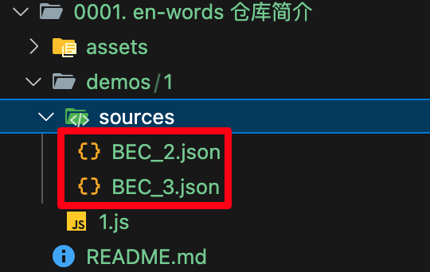
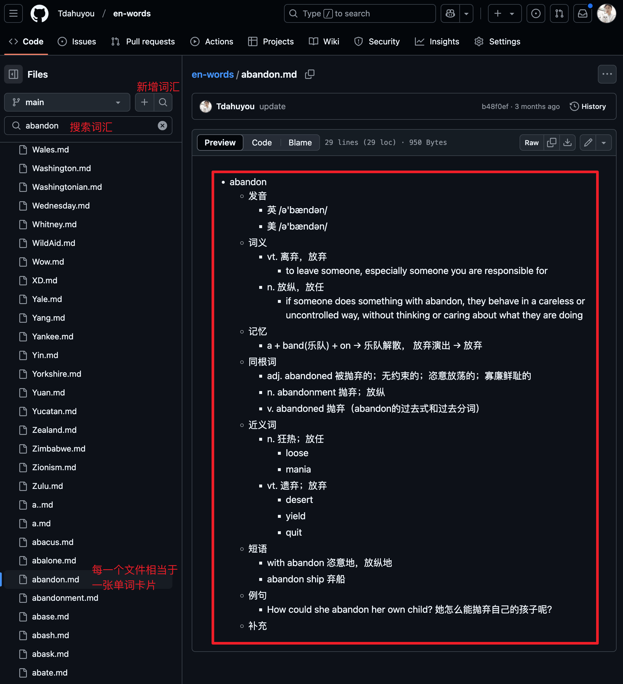

# [0001. en-words 仓库简介](https://github.com/Tdahuyou/TNotes.en-notes/tree/main/notes/0001.%20en-words%20%E4%BB%93%E5%BA%93%E7%AE%80%E4%BB%8B)

<!-- region:toc -->
- [1. 🔗 github 开源仓库 - 英语字典 - kajweb/dict](#1--github-开源仓库---英语字典---kajwebdict)
- [2. 🔗 en-words - 个人的英语词汇仓库](#2--en-words---个人的英语词汇仓库)
- [3. 📒 en-words 简介](#3--en-words-简介)
- [4. 🤔 为什么要新建一个 en-words 仓库？直接将生成的单词放在当前的 en-notes 仓库中不行吗？](#4--为什么要新建一个-en-words-仓库直接将生成的单词放在当前的-en-notes-仓库中不行吗)
- [5. 🤔 如何往 en-words 中新增词汇？](#5--如何往-en-words-中新增词汇)
- [6. 💻 demos.1 - 提取所有词汇的脚本](#6--demos1---提取所有词汇的脚本)
<!-- endregion:toc -->

## 1. 🔗 github 开源仓库 - 英语字典 - kajweb/dict

- https://github.com/kajweb/dict
- sources 中的数据来源于这个仓库。
  - 在 sources 中仅保存了两个 .json 文件，都是从 dict 仓库中解压出来获取到的文件。
  - 
- dict 中的词汇还有很多，可以一键 clone 下来，然后利用本节介绍到的脚本将这些词汇数据全部提取出来，再 push 到自己新建的专门用于存放词汇文件的仓库中统一管理。
  - 
- dict 也是 [qwerty-learner](https://qwerty.kaiyi.cool/) 英文单词数据的来源。

## 2. 🔗 en-words - 个人的英语词汇仓库

- https://github.com/Tdahuyou/en-words
  - 

## 3. 📒 en-words 简介

- en-words 目录下存放了解析后的所有单词数据。
- 单词按照统一的格式存储在一个个 .md 文件中，可以进行二次编辑，也可以扩展其它词汇，注意格式保持统一即可。
- 单词数据格式如下（以 abandon 单词为例）：
  - 首先是单词的名称
  - 紧接着是单词的
    - 发音
    - 词义
    - 同根词
    - 近义词
    - 短语
    - 例句

```md
- abandon
  - 发音
    - 英 /ə'bændən/
    - 美 /ə'bændən/
  - 词义
    - vt. 离弃，丢弃；遗弃，抛弃；完全放弃
      - to leave someone, especially someone you are responsible for
    - n. 放任，放纵
      - if someone does something with abandon, they behave in a careless or uncontrolled way, without thinking or caring about what they are doing
  - 记忆
    - a + band(乐队) + on → 一个乐队在演出 → 放纵
  - 同根词
    - adj. abandoned 被抛弃的；无约束的；恣意放荡的；寡廉鲜耻的
    - n. abandonment 抛弃；放纵
    - v. abandoned 抛弃（abandon的过去式和过去分词）
  - 近义词
    - n. 狂热；放任
      - loose
      - mania
    - vt. 遗弃；放弃
      - desert
      - yield
      - quit
  - 短语
    - with abandon 恣意地，放纵地
    - abandon ship 弃船
  - 例句
    - How could she abandon her own child? 她怎么能抛弃自己的孩子呢？
```

- 单词的格式是参照数据源中的结构来定义的。
- 保持后续插入的新词汇格式的统一，这样后续编写统一的批处理脚本会比较方便，可以对所有词汇统一整理。

## 4. 🤔 为什么要新建一个 en-words 仓库？直接将生成的单词放在当前的 en-notes 仓库中不行吗？

- en-notes.0001 中生成的单词数量很多（解析后默认有 2w 多个，后续学习过程中还会不断新增），体积有 150 多 MB，如果将单词放在 en-ntoes 中，由于单词数据和笔记数据混合在一起，会导致单词的查询成本变高。
- 将笔记和单词数据分离开，让 en-words 仓库中仅存放单词文件，这样可以减少单词的查询成本、减少单词的维护成本。单词直接丢到根目录下，同时还有助于 url 的构建和复用。

## 5. 🤔 如何往 en-words 中新增词汇？

- 可以随便在 en-words 中找一些单词，丢给 AI 去学习，让它们按照同样的单词树结构返回结果。
- 再将 AI 返回的结果在线插入到 github 仓库中。

## 6. 💻 demos.1 - 提取所有词汇的脚本

```js
/**
 * 1.js
 * 1.js 这个脚本最初是 24.10.26 时基于 en-notes.0002 中的 demo/index4.js 编写的
 * 用于提取 sources 中的所有单词，将其汇总到 results 目录中。
 */
const fs = require('fs')
const path = require('path')

const SPACE_2 = '  ';
/**
 * 源目录名
 */
const SOURCE_FOLDER_NAME = 'sources'
/**
 * 目标目录名
 */
const RESULT_FOLDER_NAME = 'results'

const SUB_TITLE = {
  sentence: '例句',
  phone: '发音',
  usphone: '美',
  ukphone: '英',
  syno: '近义词',
  remMethod: '记忆',
  relWord: '同根词',
  phrase: '短语',
  trans: '词义',
}

let sourcesFolderPath = path.join(__dirname, SOURCE_FOLDER_NAME); // sources 目录的绝对路径
let resultsFolderPath = path.join(__dirname, RESULT_FOLDER_NAME); // results 目录的绝对路径

// 创建 results 目录（如果不存在）
if (!fs.existsSync(resultsFolderPath)) {
  fs.mkdirSync(resultsFolderPath, { recursive: true });
}

const JSON_FileList = fs.readdirSync(sourcesFolderPath)
  .filter(p => p.includes('.json'))
  .map(p => path.join(sourcesFolderPath, p)) // sources 目录下所有 json 文件的绝对路径

for (let i = 0; i < JSON_FileList.length; i++) {
  writeFile(JSON_FileList[i])
}

// 写入文件
function writeFile(file_path) {
  // JSON parse
  let data = JSON.parse(
    `[${fs.readFileSync(file_path, 'utf-8')}]`
    .replaceAll(/}\r\n/g, '},')
    .replaceAll(/},]/g, '}]')
  )

  data.forEach((it, i) => {

    // if (i > 1000) return;

    if (/[\s-=?()0123456789]/.test(it.headWord)) return;

    const word = it.content.word.content

    let wordStr =
        `- ${it.headWord}\n` +
        parsePhone(word) +
        parseTrans(word) +
        parseRemMethod(word) +
        parseRelWord(word) +
        parseSyno(word) +
        parsePhrase(word) +
        parseSentence(word) +
        `${SPACE_2}- 补充`

    fs.writeFileSync(path.normalize(path.join(resultsFolderPath, `./${it.headWord.replace(/\//g, '-')}.md`)), wordStr)
  })
}

/* -- 发音部分 -- */
function parsePhone(word) {
  return `${SPACE_2}- ${SUB_TITLE.phone}
${SPACE_2}${SPACE_2}- ${SUB_TITLE.ukphone} /${word.ukphone}/
${SPACE_2}${SPACE_2}- ${SUB_TITLE.usphone} /${word.usphone}/
`
}

/* -- 词义部分 -- */
function parseTrans(word) {
  let text = ''

  // 拼接词义
  if (word.trans && word.trans.length > 0) {
    const trans = word.trans
    for (let i = 0; i < trans.length; i++) {
      const t = trans[i]
      if (t.pos && t.tranCn) text += `${SPACE_2}${SPACE_2}- ${t.pos}. ${t.tranCn.replace(/\s/g, '')}\n`
      if (t.tranOther) text += `${SPACE_2}${SPACE_2}${SPACE_2}- ${t.tranOther}\n`
    }
  }

  return `${SPACE_2}- ${SUB_TITLE.trans}
${text}`
}

/* -- 记忆部分 -- */
function parseRemMethod(word) {
  return (word.remMethod && word.remMethod.val) ? `${SPACE_2}- ${SUB_TITLE.remMethod}
${SPACE_2}${SPACE_2}- ${word.remMethod.val.trim()}
` : ''
}

/* -- 同根词部分 -- */
function parseRelWord(word) {
  let text = ''

  if (word.relWord && word.relWord.rels && word.relWord.rels.length > 0) {
    const rels = word.relWord.rels
    for (let i = 0; i < rels.length; i++) {
      const r = rels[i];
      text += r.words.map(w => `${SPACE_2}${SPACE_2}- ${r.pos}. ${w.hwd} ${w.tran.trim()}`).join('\n') + '\n'
    }
  }

  return text ? `${SPACE_2}- ${SUB_TITLE.relWord}
${text}` : ''
}

/* -- 同近词部分 -- */
function parseSyno(word) {
  let text = ''

  if (word.syno && word.syno.synos && word.syno.synos.length > 0) {
    const synos = word.syno.synos
    for (let i = 0; i < synos.length; i++) {
      const s = synos[i];
      text += `${SPACE_2}${SPACE_2}- ${s.pos}. ${s.tran}\n`
      text += s.hwds.map(h => `${SPACE_2}${SPACE_2}${SPACE_2}- ${h.w}`).join('\n') + '\n'
    }
  }

  return text ? `${SPACE_2}- ${SUB_TITLE.syno}
${text}` : ''
}

/* -- 短语部分 -- */
function parsePhrase(word) {
  let text = ''

  if (word.phrase && word.phrase.phrases) {
    const phrase = word.phrase
    const phrases = phrase.phrases
    phrases.forEach(p => {
      text += `${SPACE_2}${SPACE_2}- ${p.pContent} ${p.pCn}\n`
    })
  }

  return text ? `${SPACE_2}- ${SUB_TITLE.phrase}
${text}` : ''
}

/* -- 例句部分 -- */
function parseSentence(word) {
  let text = ''

  if (word.sentence && word.sentence.sentences) {
    const sentence = word.sentence
    const sentences = sentence.sentences
    sentences.forEach(s => {
      text += `${SPACE_2}${SPACE_2}- ${s.sContent} ${s.sCn}\n`
    })
  }

  return text ? `${SPACE_2}- ${SUB_TITLE.sentence}
${text}` : ''
}
```
