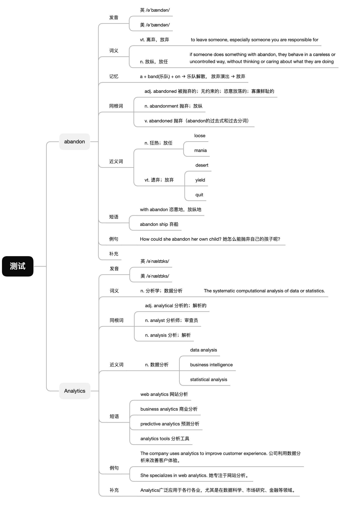

# [0005. en-words 结合幕布一起使用](https://github.com/Tdahuyou/TNotes.en-notes/tree/main/notes/0005.%20en-words%20%E7%BB%93%E5%90%88%E5%B9%95%E5%B8%83%E4%B8%80%E8%B5%B7%E4%BD%BF%E7%94%A8)

<!-- region:toc -->
- [1. 📒 基本使用流程](#1--基本使用流程)
<!-- endregion:toc -->

## 1. 📒 基本使用流程

- https://mubu.com
  - 幕布
- 比如在某一周（比如 24 年的第 43 周 10.21～10.27）需要学习单词 serial、patrol 等，那么只需要在幕布中新建一个节点，比如“第 43 周”，然后在 en-words 中搜索单词，然后复制单词文本，一键粘贴到幕布中即可。
  - 
- 具体如何分类，全凭个人喜好，也可以简单粗暴一些，比如按照数量 100 个词汇一组，遇到的陌生词汇或者是感觉比较重要的词汇都丢进去，估计要达到能看懂大部分外文技术文档的水平，十来组也就差不多了。如果有个几十组的积累，应该可以做到外文文档无障碍阅读了。
- 示例：
  - [abandon](https://github.com/Tdahuyou/en-words/blob/main/abandon.md)
  - [Analytics](https://github.com/Tdahuyou/en-words/blob/main/Analytics.md)
- 将内容复制到幕布中后的效果如下图所示：
  - 

::: code-group

```md [abandon]
- abandon
  - 发音
    - 英 /ə'bændən/
    - 美 /ə'bændən/
  - 词义
    - vt. 离弃，放弃
      - to leave someone, especially someone you are responsible for
    - n. 放纵，放任
      - if someone does something with abandon, they behave in a careless or uncontrolled way, without thinking or caring about what they are doing
  - 记忆
    - a + band(乐队) + on → 乐队解散， 放弃演出 → 放弃
  - 同根词
    - adj. abandoned 被抛弃的；无约束的；恣意放荡的；寡廉鲜耻的
    - n. abandonment 抛弃；放纵
    - v. abandoned 抛弃（abandon的过去式和过去分词）
  - 近义词
    - n. 狂热；放任
      - loose
      - mania
    - vt. 遗弃；放弃
      - desert
      - yield
      - quit
  - 短语
    - with abandon 恣意地，放纵地
    - abandon ship 弃船
  - 例句
    - How could she abandon her own child? 她怎么能抛弃自己的孩子呢？
  - 补充
```

```md [Analytics]
- Analytics
  - 发音
    - 英 /əˈnælɪtɪks/
    - 美 /əˈnælɪtɪks/
  - 词义
    - n. 分析学；数据分析
      - The systematic computational analysis of data or statistics.
  - 同根词
    - adj. analytical 分析的；解析的
    - n. analyst 分析师；审查员
    - n. analysis 分析；解析
  - 近义词
    - n. 数据分析
      - data analysis
      - business intelligence
      - statistical analysis
  - 短语
    - web analytics 网站分析
    - business analytics 商业分析
    - predictive analytics 预测分析
    - analytics tools 分析工具
  - 例句
    - The company uses analytics to improve customer experience. 公司利用数据分析来改善客户体验。
    - She specializes in web analytics. 她专注于网站分析。
  - 补充
    - Analytics广泛应用于各行各业，尤其是在数据科学、市场研究、金融等领域。
```

:::
